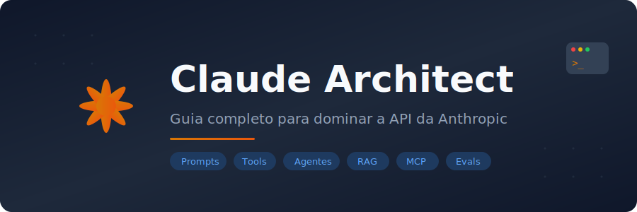

<div align="center">



<br />


&nbsp;&nbsp;&nbsp;


<br /><br />

**Guia completo para dominar a API da Anthropic — do zero ao arquiteto.**

[](https://python.org)
[](https://docs.anthropic.com)
[](https://jupyter.org)
[](LICENSE)

<br />

[Início Rápido](#-início-rápido) •
[Trilha de Aprendizado](#-trilha-de-aprendizado) •
[Projetos Finais](#-projetos-finais) •
[Contribuir](CONTRIBUTING.md)

</div>

---

##  Sobre o Projeto

O **Claude Architect** é um curso open-source e prático com **40+ notebooks interativos** que te levam do básico ao avançado no ecossistema Claude/Anthropic. Cada módulo é um Jupyter Notebook executável — aprenda fazendo, não apenas lendo.

```
  Prompt Engineering → API & Integração → Tool Use → Agentes → MCP → RAG → Evals → Arquitetura → Projetos
```

> Criado em colaboração com o [Claude](https://claude.ai) (Anthropic)

---

##  Início Rápido

### Pré-requisitos

- Python 3.10+
- Uma chave de API da Anthropic → [console.anthropic.com](https://console.anthropic.com)

### Instalação

```bash
# 1. Clone o repositório
git clone https://github.com/SEU_USUARIO/claude-architect.git
cd claude-architect

# 2. Setup automático (cria venv, instala deps, configura kernel)
make setup

# 3. Configure sua chave
cp .env.example .env
# Edite .env e adicione: ANTHROPIC_API_KEY=sk-ant-...

# 4. Inicie os notebooks
make run
```

<details>
<summary><b>Setup manual (sem Make)</b></summary>

```bash
python -m venv .venv
.venv\Scripts\activate        # Windows
# source .venv/bin/activate   # Linux/Mac

pip install -r requirements.txt
python bootstrap.py
jupyter notebook
```

</details>

---

##  Trilha de Aprendizado

O curso é dividido em **9 módulos progressivos**. Cada semana cobre um tema, com notebooks práticos e exercícios.

| Semana | Módulo | Tópicos | Notebooks |
|:------:|--------|---------|:---------:|
| 1-2 | **01 — Prompt Engineering** | Fundamentos, System Prompts, Few-shot, CoT, XML Tags, Output Control, Prompt Injection | 7 |
| 3 | **02 — API & Integração** | Primeiros Passos, Modelos & Custos, Streaming, Tokens, Multimodal (Imagens + PDF), Batch | 7 |
| 4 | **03 — Tool Use** | Introdução, Tools Customizados, Multi-tool, APIs Externas, Prompt Caching | 5 |
| 5 | **04 — Agentes** | Conceitos, Agente Simples, Orchestrator Pattern, Multi-Agent Pipeline, HITL, Memória | 6 |
| 6 | **05 — MCP** | Intro ao Protocol, Cliente Python, Servidor Custom, MCP com Agentes | 4 |
| 7 | **06 — RAG** | Conceitos, Embeddings & Busca, RAG Simples, RAG Avançado, RAG com Claude | 5 |
| 8 | **07 — Evals** | Por que Avaliar, Evals Básicos, LLM-as-Judge, Evals em Escala, Dashboard | 5 |
| 9-10 | **08 — Arquitetura** | Guardrails, Latência vs Qualidade, Multi-modelo, Observabilidade, Design de Sistemas | 5 |
| 11-12 | **09 — Projetos Finais** | 4 projetos completos de ponta a ponta | 4 |

> **Total: 48 notebooks** cobrindo todo o ecossistema Claude

---

##  Projetos Finais

Os projetos do módulo 09 consolidam tudo que você aprendeu:

| Projeto | O que você constrói |
|---------|-------------------|
| **Chatbot Robusto** | Chatbot production-ready com guardrails, memória e fallbacks |
| **Agente Pesquisador** | Agente autônomo que pesquisa, sintetiza e gera relatórios |
| **Pipeline RAG Completo** | Sistema RAG end-to-end com ingestão, busca e geração |
| **Sistema Multiagente** | Orquestração de múltiplos agentes especializados |

---

##  Estrutura do Projeto

```
claude-architect/
├── 01_prompt_engineering/   # Fundamentos de prompting
├── 02_api_integracao/       # Integração com a API
├── 03_tool_use/             # Function calling & tools
├── 04_agentes/              # Padrões de agentes
├── 05_mcp/                  # Model Context Protocol
├── 06_rag/                  # Retrieval-Augmented Generation
├── 07_evals/                # Avaliação de qualidade
├── 08_arquitetura/          # Padrões de produção
├── 09_projetos_finais/      # 4 projetos completos
├── aulas/                   # Material complementar
├── tests/                   # Testes e CI
├── assets/                  # Logos e imagens
├── bootstrap.py             # Script de setup
├── Makefile                 # Automação
└── requirements.txt         # Dependências
```

---

##  Contribuindo

Contribuições são bem-vindas! Veja o [CONTRIBUTING.md](CONTRIBUTING.md) para detalhes sobre como contribuir.

---

##  Licença

MIT — use, modifique e compartilhe à vontade.

---

<div align="center">


<br />

Feito com [Claude](https://claude.ai) · Anthropic
